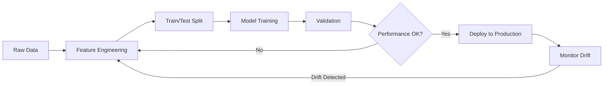

# AI/ML Models Documentation

## Overview

The UAE Car Showroom Management System integrates AI/ML capabilities across multiple business functions. All models are designed to be trained on dealership data and improve over time.

## 1. Price Prediction Model

### Purpose
Estimate optimal market price for vehicles based on multiple features.

### Algorithm
- **Primary:** Gradient Boosting Regressor (scikit-learn)
- **Fallback:** XGBoost Regressor
- **Ensemble:** Weighted average of multiple models

### Features
```python
features = [
    "year",              # Vehicle manufacturing year
    "mileage",           # Current mileage (km)
    "engine_capacity",   # Engine size (liters)
    "brand_id",          # Brand encoding
    "model_age",         # Age of model (current_year - model_year)
    "condition_new",     # Is new (boolean)
    "transmission",      # Automatic/Manual encoding
    "fuel_type",         # Fuel type encoding
    "color_popularity",  # Color demand score
    "days_in_stock",     # Days in inventory
    "market_demand",     # Regional demand score
]
```

### Training
```python
from app.ai.price_prediction import price_predictor

# Train with historical sales data
price_predictor.train(vehicles_data)

# Predict price for a vehicle
predicted_price = price_predictor.predict({
    "year": 2024,
    "mileage": 15000,
    "engine_capacity": 3.0,
    "condition": "certified",
    "transmission": "automatic",
})
```

### Performance Metrics
- R² Score: >0.85
- MAE: < AED 8,000
- RMSE: < AED 12,000
- MAPE: < 8%

## 2. Lead Scoring Model

### Purpose
Score leads based on conversion probability to prioritize sales efforts.

### Algorithm
- **Primary:** Random Forest Classifier
- **Ensemble:** XGBoost + Logistic Regression

### Features
```python
features = [
    "budget_range",          # Budget width (max - min)
    "financing_required",    # Needs financing
    "trade_in_interest",     # Has trade-in
    "contact_frequency",     # Past engagement count
    "source_quality",        # Lead source score
    "urgency_signals",       # Timeframe indicators
    "previous_interactions", # Past interaction count
    "brand_loyalty",         # Previous brand purchases
    "budget_affordability",  # Budget vs vehicle price match
]
```

### Scoring Output
```python
lead_score = lead_scorer.score(lead_data)
# Returns 0-100 score
# 0-20: Cold
# 21-50: Warm
# 51-80: Hot
# 81-100: Critical
```

## 3. Demand Forecasting Model

### Purpose
Predict future sales demand by model, brand, and category.

### Algorithm
- **Primary:** ARIMA with seasonal decomposition
- **Deep Learning:** LSTM for complex patterns
- **Ensemble:** Prophet + Linear Regression

### Features
```python
features = [
    "historical_sales",      # Monthly sales by model
    "seasonality",           # Seasonal patterns
    "marketing_spend",       # Advertising impact
    "new_model_launches",    # Launch events
    "economic_indicators",   # Market conditions
    "competitor_activity",   # Competitive landscape
    "inventory_levels",      # Current stock
    "price_trends",          # Pricing changes
]
```

### Forecast Horizon
- Short-term: 1-3 months
- Medium-term: 3-6 months
- Long-term: 6-12 months

## 4. Recommendation Engine

### Purpose
Provide personalized vehicle, financing, and upsell recommendations.

### Algorithm
- **Content-Based Filtering** using Sentence-BERT embeddings
- **Collaborative Filtering** for returning customers
- **Hybrid Approach** combining both

### Implementation
```python
from app.ai.recommendation import recommendation_engine

# Vehicle recommendations
recommended = recommendation_engine.recommend_vehicles(
    customer_profile={
        "preferences": "luxury SUV under 300k AED",
        "budget_max": 300000,
    },
    available_vehicles=vehicles_list,
    top_k=5,
)

# Financing recommendations
finance_plans = recommendation_engine.recommend_financing(
    customer_profile={"annual_income": 240000},
    available_plans=loan_products,
)
```

## 5. Customer Churn Prediction

### Purpose
Identify customers at risk of not returning for service or purchase.

### Algorithm
- **XGBoost Classifier** with class imbalance handling
- **Feature engineering** from customer history

### Features
```python
features = [
    "days_since_last_visit",       # Recency
    "service_visits_per_year",     # Frequency
    "average_service_spend",       # Monetary
    "warranty_expired",            # Warranty status
    "vehicle_age",                 # Age of owned vehicle
    "competition_engagement",      # External interactions
    "satisfaction_score",          # Past CSAT scores
    "complaint_history",           # Negative interactions
]
```

## 6. Fraud Detection Model

### Purpose
Detect suspicious transactions and potential fraud.

### Algorithm
- **Isolation Forest** for anomaly detection
- **XGBoost** for known fraud patterns
- **Rule-based system** for compliance

### Detection Rules
```python
fraud_signals = [
    "multiple_high_value_leads",      # Many expensive leads
    "inconsistent_identity",          # Mismatched documents
    "payment_anomaly",                # Unusual payment patterns
    "rapid_succession_transactions",  # Velocity check
    "geographic_mismatch",            # Location inconsistency
    "device_fingerprint",             # Known bad devices
]
```

## 7. Intelligent Chat Assistant

### Purpose
Handle customer inquiries and qualify leads through natural conversation.

### Implementation
- **Rule-based + ML hybrid** approach
- **Sentence-BERT** for intent classification
- **Template-based** responses with personalization

### Supported Intents
```python
intents = [
    "greeting",
    "vehicle_inquiry",
    "brand_inquiry",
    "price_inquiry",
    "finance_inquiry",
    "test_drive_request",
    "trade_in_inquiry",
    "service_inquiry",
    "warranty_inquiry",
    "contact_request",
]
```

## Model Training Pipeline



## Model Registry

All models are stored in the `app/ai/models/` directory:
```
models/
├── price_model.pkl
├── lead_scorer.pkl
├── demand_model.pkl
├── churn_model.pkl
├── fraud_model.pkl
├── encoder.pkl
└── scaler.pkl
```

## Retraining Strategy

| Model | Retrain Frequency | Trigger |
|-------|-------------------|---------|
| Price Prediction | Weekly | New 100+ sales |
| Lead Scoring | Bi-weekly | 500+ new leads |
| Demand Forecast | Monthly | New month |
| Churn Prediction | Monthly | Quarterly |
| Fraud Detection | Daily | New transactions |
| Recommendations | On-demand | Model update request |

## Ethical AI

- Regular bias testing across demographics
- Explainability (SHAP values) for all predictions
- Human-in-the-loop for high-stakes decisions
- Transparent scoring methodology
- Customer consent for ML-based profiling
